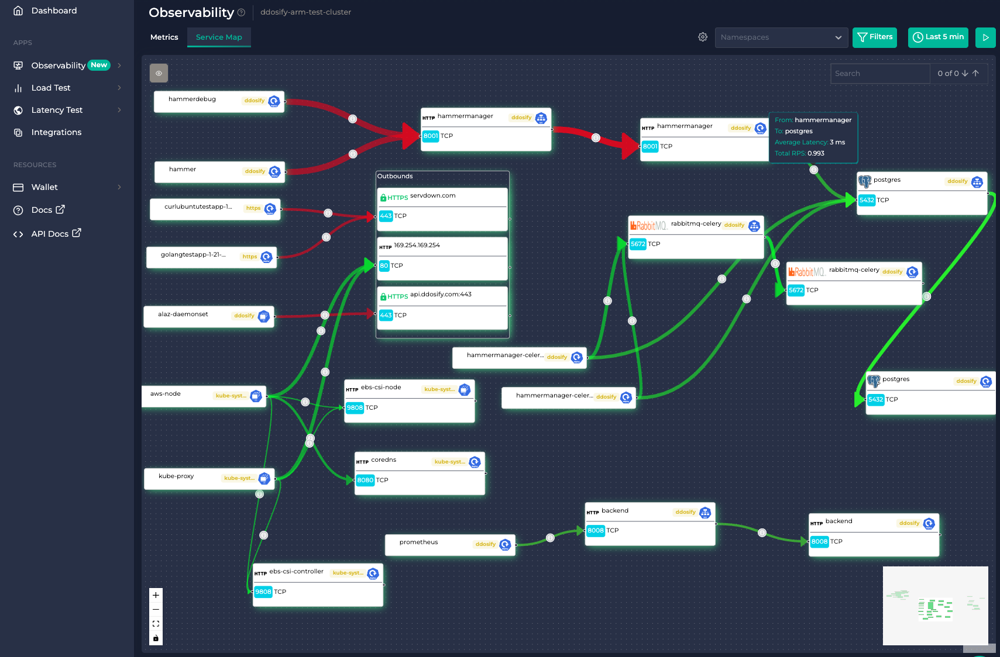
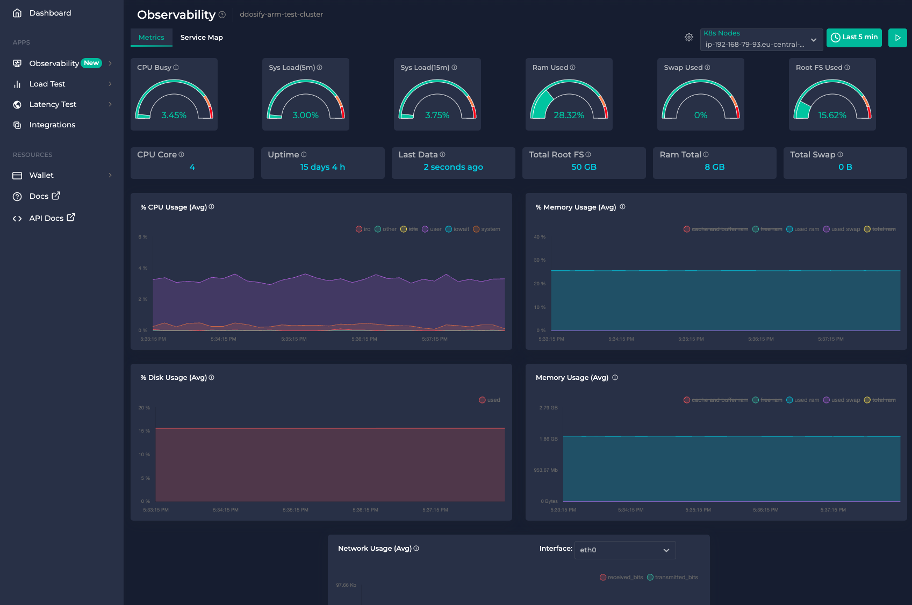
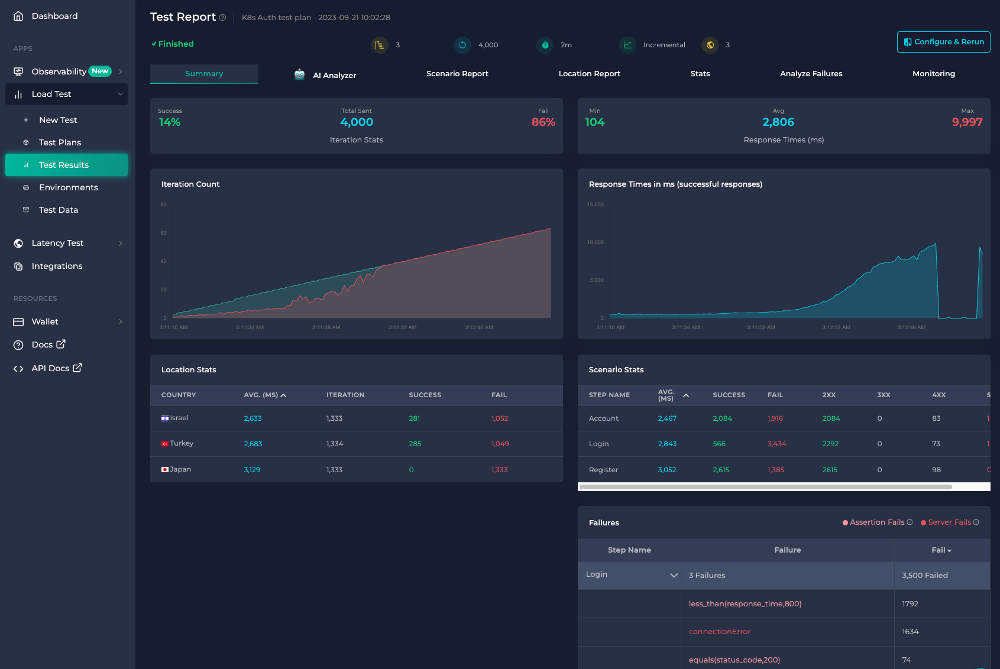
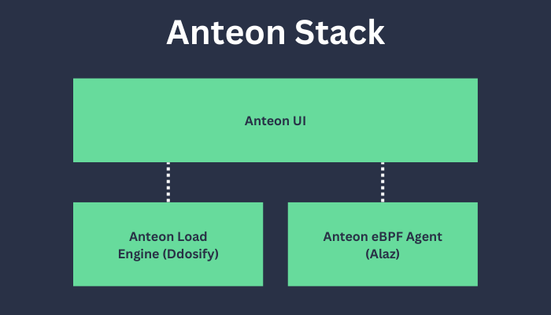
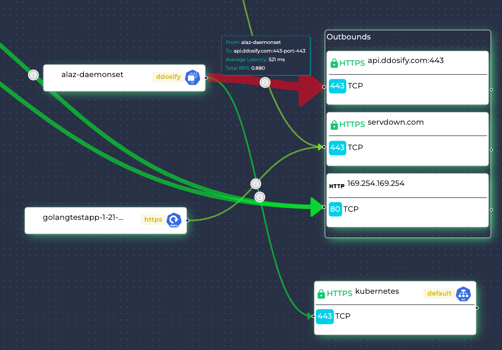

<div align="center">
    <br />
    <br />
</div>

<h1 align="center">Kickstart Kubernetes Monitoring in 1 min - Free up time for DevOps and Coding</h1>

<p align="center">
    <a href="https://github.com/getanteon/anteon/releases" target="_blank"></a>&nbsp;
    <a href="https://github.com/getanteon/anteon/actions/workflows/test.yml" target="_blank"></a>&nbsp;
    <a href="https://github.com/getanteon/anteon/blob/master/LICENSE" target="_blank"></a>
    <a href="https://discord.gg/9KdnrSUZQg" target="_blank"></a>
    <a href="https://landscape.cncf.io/?item=observability-and-analysis--observability--anteon" target="_blank"></a>
</p>

<p align="center">

<i>Anteon automatically generates Service Map of your K8s cluster without code instrumentation or sidecars. So you can easily find the bottlenecks in your system. Red lines indicate the high latency between services.</i>
</p>

<h2 align="center">
    <a href="https://demo.getanteon.com/" target="_blank">Live Demo</a> •
    <a href="https://getanteon.com/docs" target="_blank">Documentation</a> •
    <a href="https://discord.gg/9KdnrSUZQg" target="_blank">Discord</a>
</h2>

## What is Anteon (formerly Ddosify)?

Anteon (formerly Ddosify) is an [open-source](https://github.com/getanteon/anteon), eBPF-based **Kubernetes Monitoring** and **Performance Testing** platform.


### 🔎 Kubernetes Monitoring

- **Automatic Service Map Creation:** Anteon automatically creates a **service map** of your cluster without code instrumentation or sidecars. So you can easily find the bottlenecks in your system.
- **Performance Insights:** It helps you spot issues like services taking too long to respond or slow SQL queries.
- **Real-Time Metrics:** The platform tracks and displays live data on your cluster instances CPU, memory, disk, and network usage.
- **Ease of Use:** You don't need to change any code, restart services, or add extra components (like sidecars) to get these insights, thanks to the [eBPF based agent (Alaz)](https://github.com/getanteon/alaz).
- **Alerts for Anomalies:** If something unusual, like a sudden increase in CPU usage, happens in your Kubernetes (K8s) cluster, Anteon immediately sends alerts to your Slack.
- **Seamless Integration with Performance Testing:** Performance testing is natively integrated with Kubernetes monitoring for a unified experience.
- **Distributed Tracing:** Anteon automatically collects traces from your Kubernetes cluster and generates context propagation without changing a single line of code.

<p align="center">

<i>Anteon tracks and displays live data on your cluster instances CPU, memory, disk, and network usage.</i>
</p>

### 🔨 Performance Testing

- **Multi-Location Based:** Generate load/performance tests from over 25 countries worldwide. Its available on [Anteon Cloud](https://getanteon.com/).
- **Easy Scenario Builder:** Create test scenarios easily without writing any code.
- **Seamless Integration with Kubernetes Monitoring:** Performance testing is natively integrated with Kubernetes monitoring for a unified experience.
- **Postman Integration:** Import tests directly from Postman, making it convenient for those already using Postman for API development and testing.

<p align="center">

<i>Anteon Performance Testing generates load from worldwide with no-code scenario builder.</i>
</p>

## Anteon Stack

Anteon Stack consists of 4 parts:

- [Anteon Load Engine (Ddosify)](#anteon-load-engine-ddosify)
- [Anteon eBPF Agent (Alaz)](#anteon-ebpf-agent-alaz)
- [Anteon Self-Hosted](#anteon-self-hosted)
- [Anteon Cloud](#anteon-cloud)


<p align="center"> 

</p>

### Anteon Load Engine (Ddosify)

[Ddosify](https://github.com/getanteon/anteon/tree/master/ddosify_engine) is the load engine, written in Golang. It's a CLI load-testing tool. Anteon Self-Hosted and Anteon Cloud use it under the hood for load generation. It is fully open-source and can be used on the CLI as a standalone tool. It has ~8K Github Stars. Ddosify is available via [Docker](https://hub.docker.com/r/getanteon/anteon), [Docker Extension](https://hub.docker.com/extensions/getanteon/anteon-docker-extension), [Homebrew Tap](https://github.com/getanteon/anteon/tree/master/ddosify_engine#homebrew-tap-macos-and-linux), and downloadable pre-compiled binaries from the [releases page](https://github.com/getanteon/anteon/releases/tag/v1.0.6) for macOS, Linux, and Windows.

Check out the [Ddosify Docs](https://github.com/getanteon/anteon/tree/master/ddosify_engine) page for more information and usage.

### Anteon eBPF Agent (Alaz)
[Alaz](https://github.com/getanteon/alaz) is an open-source Anteon eBPF agent that can inspect and collect Kubernetes (K8s) service traffic without the need for code instrumentation, sidecars, or service restarts. Alaz is deployed as a DaemonSet on your Kubernetes cluster. It collects metrics and sends them to Anteon Cloud or Anteon Self-Hosted. It is also Prometheus compatible, so that you can use it as a standalone tool.

Check out the [Alaz](https://github.com/getanteon/alaz) repository for more information and usage.

### Anteon Self-Hosted

[Anteon Self-Hosted](https://github.com/getanteon/anteon/tree/master/selfhosted) features a web-based user interface, **Performance Testing**, and **Kubernetes Monitoring** capabilities. You can add your servers as Load Engines to the platform for distributed performance testing. While it shares many of the same functionalities as Anteon Cloud, the Self-Hosted version is designed to be deployed within your infrastructure for enhanced control and customization. 

It has two versions: Community Edition (CE) and Enterprise Edition (EE). You can see the differences in the below [comparison table](#comparison-of-anteon-cloud-self-hosted-ee-self-hosted-ce).

Check out our [Github Page](https://github.com/getanteon/anteon/tree/master/selfhosted) for more information and usage.


#### Quick Start

(1) Deploy using Docker Compose:

```bash
curl -sSL https://raw.githubusercontent.com/getanteon/anteon/master/selfhosted/install.sh | bash
```
<p align="center">
    <a href="https://aws.amazon.com/marketplace/pp/prodview-mwvnujtgjedjy" target="_blank"></a>&nbsp;
</p>

(2) You can deploy Anteon Self Hosted on Kubernetes using the [Helm chart](https://github.com/getanteon/anteon-helm-charts).

### Anteon Cloud

[Anteon Cloud](https://app.getanteon.com/) features a SaaS, web-based user interface, multi-location-based **Performance Testing**, and **Kubernetes Monitoring**. Anyone can test the performance of backend endpoints, monitor Kubernetes Clusters, and find the bottlenecks in the system. It has a simple/no code UI, insightful charts, service maps, and more features. 

With Anteon Cloud, you can generate traffic to your endpoints from 25+ countries without code or scripting. 

Check out [Anteon Cloud](https://app.getanteon.com/) to find the performance issues on your system instantly.

### Comparison of Anteon Cloud, Self-Hosted EE, Self-Hosted CE
<p align="center">


*CE: Community Edition, EE: Enterprise Edition*
</p>

## Kubernetes Monitoring Features

#### ✅ Service Map
Easily get insights about what is going on in your cluster. You do not have to change your code or add sidecars anymore. <a href="https://getanteon.com/docs/kubernetes-monitoring/service-map" target="_blank">More →</a>
<p align="left">

</p>

#### ✅  Detailed Insights
Inspect incoming, outgoing traffic, SQL queries, golden signals, HTTP 5xx status codes, Top Latencies and RPS, and more. <a href="https://getanteon.com/docs/kubernetes-monitoring/service-map" target="_blank">More →</a>
<p align="left">

</p>

#### ✅  Metrics Dashboard
The Metric Dashboard provides a straightforward way to observe Node Metrics. Anteon observes CPU, Memory, Disk, and Network usage of your nodes. You can also create alerts on these metrics. <a href="https://getanteon.com/docs/kubernetes-monitoring/metrics" target="_blank">More →</a>

<p align="left">

</p>

#### ✅  Find Bottlenecks 
Start a load test and monitor your system all within the same UI. You do not need to correlate the load test results with the monitoring data and switch between different tools.

You will see the outgoing requests, response times and status codes on the load test **Summary** tab. 
<p align="left">

</p>

You will see the incoming requests to your K8s cluster, service-to-service traffic, RPS, latencies, SQL queries, and more on the **Monitoring** tab. So you can easily correlate the load test results with the monitoring data without switching between different tools.
<p align="left">

</p>

#### ✅ Distributed Tracing

Anteon automatically collects traces from your Kubernetes cluster and generates context propagation without changing a single line of code. <a href="https://getanteon.com/docs/kubernetes-monitoring/distributed-tracing" target="_blank">More →</a>


## Performance Testing Features
#### ✅  Parametrization
Use built-in random data generators. <a href="https://getanteon.com/docs/performance-testing/parametrization" target="_blank">More →</a>
<p align="left">

</p>


#### ✅  CSV Data Import
Import test data from CSV and use it in the scenario. <a href="https://getanteon.com/docs/performance-testing/test-data-import" target="_blank">More →</a>
<p align="left">

</p>

#### ✅  Environments
Store constant values as environment variables. <a href="https://getanteon.com/docs/performance-testing/environment-variables" target="_blank">More →</a>
<p align="left">

</p>

#### ✅  Correlation
Extract variables from earlier phases and pass them on to the following ones. <a href="https://getanteon.com/docs/performance-testing/correlation" target="_blank">More →</a>
<p align="left">

</p>

#### ✅  Assertion
Verify that the response matches your expectations. <a href="https://getanteon.com/docs/performance-testing/assertion" target="_blank">More →</a>
<p align="left">

</p>

#### ✅  Debugging
Analyze request and response data before starting the load test. <a href="https://getanteon.com/docs/performance-testing/debugging" target="_blank">More →</a>
<p align="left">

</p>

#### ✅  Postman Import
Import Postman collections with ease and transform them into load testing scenarios. <a href="https://getanteon.com/docs/performance-testing/postman-import" target="_blank">More →</a>
<p align="left">

</p>


## About This Repository

This repository includes the source code for the Anteon Load Engine(Ddosify). You can access Docker Images for the Anteon Engine and Self Hosted on <a href="https://hub.docker.com/u/getanteon" target="_blank">Docker Hub</a>. Since Anteon is a Verified Publisher on Docker Hub, you do not have any pull limits.

The [Ddosify Docs](https://github.com/getanteon/anteon/tree/master/ddosify_engine) folder provides information on the installation, usage, and features of the Anteon Load Engine (Ddosify). The [Self-Hosted](https://github.com/getanteon/anteon/tree/master/selfhosted) folder contains installation instructions for the Self-Hosted version. [Anteon eBPF agent (Alaz)](https://github.com/getanteon/alaz) has its own repository. 

To learn about the **Performance Testing** usage of both Self-Hosted and Cloud versions, please refer to the [this documentation](https://getanteon.com/docs/performance-testing/test-suite). For the **Kubernetes Monitoring** usage, please refer to the [this documentation](https://getanteon.com/docs/kubernetes-monitoring).

## Communication

You can join our [Discord Server](https://discord.gg/9KdnrSUZQg) for issues, feature requests, feedbacks or anything else. 

## Disclaimer

Anteon is created for testing the performance of web applications. Users must be the owner of the target system. Using it for harmful purposes is extremely forbidden. Anteon team & company is not responsible for its’ usages and consequences.

## License

Licensed under the AGPLv3: https://www.gnu.org/licenses/agpl-3.0.html
