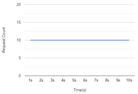
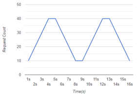

# **Ddosify** - High-performance load testing tool

Ddosify is a high-performance load testing tool. It is protocol agnostic, able to run scenarios, supports different load types.

TODO: GIF KOY

## Installation
TODO:Fatih

# Easy Start
This section aims to show how to use Ddosify without deepig dive into its details. TODO: 
1. Simple load test

		atack with default values

2. Using some of the available features.

		atack with adding loadtype

3. Making things a bit complex

		attack with config file
		
# Details

You can configure your load test by the CLI options or a config file. Config file supports more features than the CLI. For example you can't create scenario based load test with CLI options.

1. **CLI Flags**

        ddosify -t <target_website> [options...]

    1. `-n`

        Total request count. Default is 200.
    2. `-d`

        Test duration in seconds. Default is 10 second.
    3. `-l`

        Type of the load test. Default is "linear". Ddosify supports 3 load types;
        1. `-l linear`

            Example; 

                ddosify -t target_site.com -n 200 -d 10 -l linear

            Result;

            

            *Note:* If the request count is too low for the given duration, the test would be finished earlier than you expect. 10 request per second is the lower limit to run this load type smoothly.

        2. `-l incremental`
        
            Example;

                ddosify -t target_site.com -n 200 -d 10 -l incremental

            Result;

            
            
        3. `-l waved`
            
            Example;

                ddosify -t target_site.com -n 400 -d 16 -l waved

            Result;

            

            *Note:* Wave count equals to `log2(duration) / 2`.
    4. `-p`

        Protocol of the request. Defaul is HTTPS. Supported protocols [HTTP, HTTPS]. HTTP2 support only available by using config file as described here.(TODO: href).More protocols will be added.
        
        *Note:* If the target url passed with `-t` option includes protocol inside of it, then the value of the `-p` will be ignored.
    
    5. `-m`

        Request method. Default is GET. For Http(s):[GET, POST, PUT, DELETE, UPDATE, PATCH]

    6. `-b` 

        Payload of the network packet

    7. `-a`

        Basic authentication. 

        Usage;

            ddosify -t target_site.com -a username:password

    8. `-h`

        Request headers. You can provide multiple headers.

        Usage;

            ddosify -t target_site.com -h 'Accept: text/html' -h 'Content-Type: application/xml'
    
    9. `-T`

        Request timeout in seconds. Default is 5 second.

    10. `-P`

        Proxy address as host:port. 

        Usage;

            ddosify -t target_site.com -P http://proxy_host.com:port'

    11. `-o`

        Test result output destination. Default is *stdout*. Other output types will be added.

2. **Config File**

    Config file is more flexible than the CLI usage and it lets you to use all capabilities of the Ddosify. 
    
    The features only can be used by a config file;
    - Scneario creation.
    - Payload from a file.
    - Extra connection configuration, like *keep-alive* enable/disable logic.
    - Supports HTTP2. 

    Usage;

        ddosify -config <json_config_path>

    Ddosify accepts only JSON file as a config input.

  

Usage;

ddosify -config <config_file_path>

  

4.2.1- "reqCount"

This is the equilevent of the -n option. The difference is that if you have multiple steps in your scenario than

this value represent the iteration count of your steps.

  

5- **Future**

